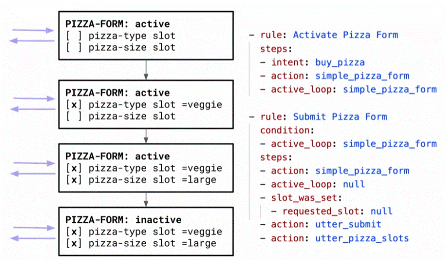
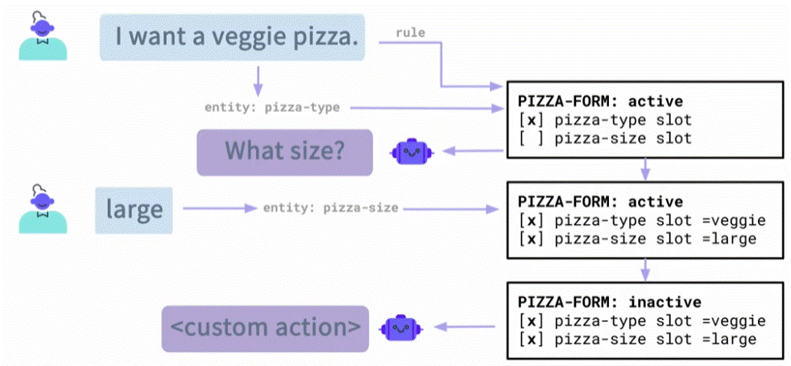
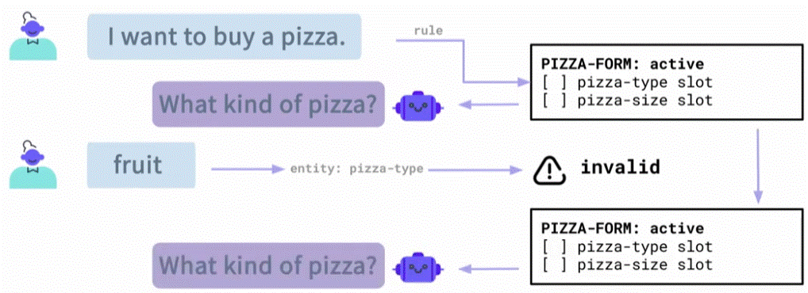

<div align="center">

# **Basic Forms (Slot filling)**
</div>

A form is a way to collect **several pieces of information (slots)** from the user in a structured way — like filling out a form in a conversation.

Think of it like an online form, but instead of clicking, the user gives answers in chat.


To configure a __form__ in Rasa. you need to set 2 rules in the rules.yml file (or in a story). 
  1. rule to __activate__ the form (Activate Pizza Form).
  2. another that will __deactivate__ the form, once the all filed are filled.



1. once the form is triggerd it will __automaticaly__ ask for required slots (you just need define the information required, but no need to write a story for asking the filling questions).
2. The Rasa form will only ask for information that the user hasn't provided yet.



### validating form input
if the input of the user is invalid. we can prevent the slot from being set, and we getting the opportunity to ask the user again (giving him some more information - for giving correct answer).



## Example for implemanting  Form
In this example, we creating a pizza order form containig two values (type and size) to be filled. it will validate the input and set a order using roles.

__Step 1:__
Inside the __nlu.yml__ file we added 2 intents:

```yaml
- intent: buy_pizza
  examples: |
    - i'd like to buy pizza
    - i want a pizza
    - can i buy a pizza
    - i'm interested in a savory round flattened bread of Italian origin
    - i want to buy pizza

- intent: inform
  examples: |
    - i'd like a [large](pizza_size) pizza
    - i want to order a [xl](pizza_size) [hawai](pizza_type) pizza
    - [medium](pizza_size)
    - [xl](pizza_size)
    - [small](pizza_size)
    - [s](pizza_size)
    - [pepperoni](pizza_type)
    - give me a [mozerella](pizza_type) pizza
    - [hawaii](pizza_type)
    - i want a [large](pizza_size) pizza
    - [mozzarella](pizza_type)
    - [veggie](pizza_type)
    - [fungi](pizza_type)
    - [S](pizza_size)
```
__Step 2:__
Adding 2 rules for activating the form and the order pizza:
  1. first rule - start the form forming (when ever the buy_pizza intent detected - the pizza form is activated and its loop as well).
  2. second rule - handles the submission of the form. given there is a submission form active (under condition inthe rule) it check if it stped (the form filled (requested_slot: null). the form will stop and continue the role (utter_submit and utter_pizza_slots will procced)
Inside the __rules.yml__ file:

```yaml
- rule: Activate Pizza Form
  steps:
  - intent: buy_pizza
  - action: simple_pizza_form
  - active_loop: simple_pizza_form

- rule: Submit Pizza Form
  condition:
  - active_loop: simple_pizza_form
  steps:
  - action: simple_pizza_form
  - active_loop: null
  - slot_was_set:
    - requested_slot: null
  - action: utter_submit
  - action: utter_pizza_slot
```
__Step 3:__
define the form in the __domain.yaml__ file. we need to add an:
  * intent - for buying pizza
  * declare entities we need (pizza size and type)
  * add slots for the entities.
  * declare the __form__ (and its requered slots)
  * responses - added responcess relevent - utter_pizza_slot, utter_submit and most important the __utter_ask__[slot_name] messages (these utter must follow naming convection __utter_ask__[slot_name] for that assistant will know to use them in the form handleing)
  * add the validate __custom action__ to validate the form values

under intent, add this intent:
```yaml
      - request_pizza_form
```
adding in entities:
```yaml
  - pizza_size
  - pizza_type
```
adding 2 slots:
```yaml
  pizza_size:
    type: text
    influence_conversation: true
    mappings:
    - type: from_entity
      entity: pizza_size
  pizza_type:
    type: text
    influence_conversation: true
    mappings:
    - type: from_entity
      entity: pizza_type  
```
Add a form section (if not exsisting)
```yaml
forms:
  simple_pizza_form:
    required_slots:
      - pizza_size
      - pizza_type
```
Add resposes (nder responses):
```yaml
  utter_submit:
  - text: I will now order a pizza for you!
  utter_pizza_slot:
  - text: i will order a {pizza_size} {pizza_type} pizza.
  utter_ask_continue:
  - text: Are you sure you want to stop the form?
  utter_ask_pizza_size:
  - text: what size would you like your pizza to be?
  utter_ask_pizza_type:
  - text what kind of pizza you like to buy?
```
Add under actions:
```yaml
    - utter_pizza_slot
    - utter_submit
    - validate_simple_pizza_form
```
__* Note__ the "validate_simple_pizza_form" followes a naming convection (validate_[name_of_form]) - it a custom action (validate_) that allow to validate the input of the form ([name_of_form] using python code.

__Step 4:__
in the __action.py__ file we add a class for the validation;

we need to add in the import part (FormValidationAction) - its;
__*Note:__ the def for validating must follow a naming convection **validate_[slot_name]** so that the validation will work (this way the assistant can find the validation that fit)

```python
    from rasa_sdk import Tracker, FormValidationAction, Action
```
Added this variables for validating the correct size and type
```python

  ALLOWED_PIZZA_SIZES = {
    "small": ["s", "small"],
    "medium": ["m", "medium"],
    "large": ["l", "large"],
    "extra-large": ["xl", "extar-large"]
}
ALLOWED_PIZZA_TYPES = [
    "margherita",
    "pepperoni",
    "veggie",
    "hawaiian",
    "four cheese"
]
```
Add this validation class:
```python
class ValidationSimplePizzaForm(FormValidationAction):
    def name(self) -> Text:
        return "validate_simple_pizza_form"

    def validate_pizza_size(self, slot_value: Any, dispatcher: CollectingDispatcher, tracker: Tracker, domain: DomainDict) -> Dict[Text, Any]"
        """Validate 'pizza_size' value"""

        if slot_value.lower() not in ALLOWED_PIZZA_SIZES:
            dispatcher.utter_message(text=f"We only accept pizza sizes: s/m/l/xl."
            return {"pizza_size": None}
        dispatcher.utter_message(text=f"OK! You want to have a {slot_value} pizza."
        return {"pizza_size": slot_value}

    def validate_pizza_type(self, slot_value: Any, dispatcher: CollectingDispatcher, tracker: Tracker, domain: DomainDict) -> Dict[Text, Any]"
        """Validate 'pizza_type' value"""

        if slot_value.lower() not in ALLOWED_PIZZA_TYPES:
            dispatcher.utter_message(text=f"I don't recognize that pizza. we serve: {','.join(ALLOWED_PIZZA_TYPES)}."
            return {"pizza_type": None}
        dispatcher.utter_message(text=f"OK! You want to have a {slot_value} pizza."
        return {"pizza_type": slot_value}
```

