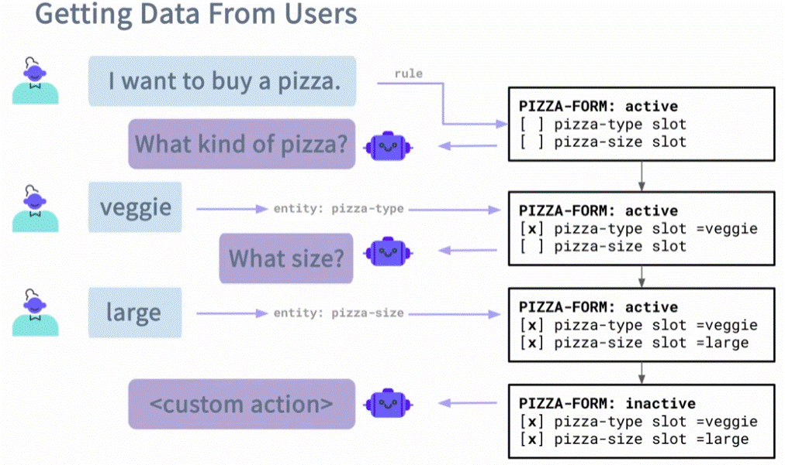

# **Custom Forms (Slot filling)**

A form is a way to collect __several pieces of information (slots)__ from the user in a structured way — like filling out a form in a conversation.

Think of it like an online form, but instead of clicking, the user gives answers in chat.

