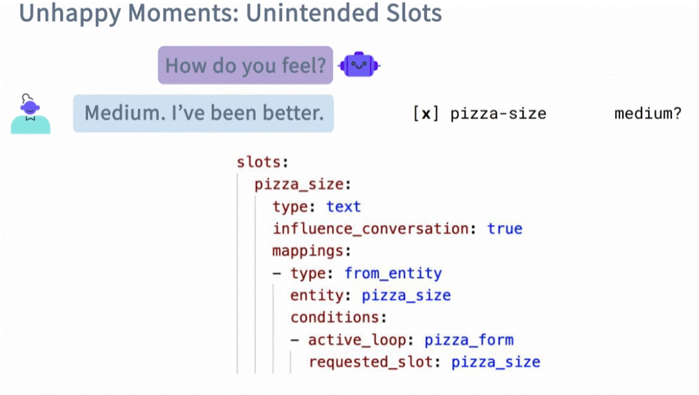
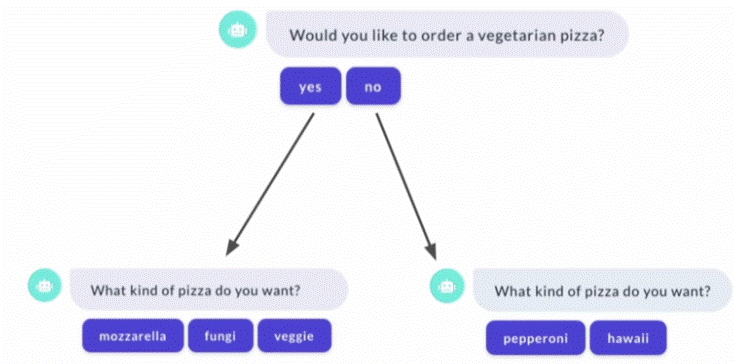

<div align="center">

# **Custom Forms (Slot filling)**
</div>

Custom forms let you handle unexpected user answers and create more flexible, dynamic conversations by controlling exactly how and when slots are asked, validated, or skipped. makes the  conversations flexible, letting you handle surprises and guide users dynamically.

## Examples of dealing with Un-Happy path

### 1. Here the conversation is disturbed by asking out of the form questions - we want to answer it and go back to fill the form:


To do this we configure an extra __Rule__:
```yaml
    - rule: Interruption in Pizza Form
      condition:
      # Condition that form is active
      - active_loop: simple_pizza_form
      steps:
      # The case of an intent 'bot_challenge'
      - intent: bot_challenge
      - action: utter_iababot
      # Return to form
      - action: simple_pizza_form
      - active_loop: simple_pizza_form
```
This rule triggered if only if the form was interupted (active_loop). and there is an intent (bot_challenge) that follow by the action (utter_iamabot). that will answer the intrupt question. once is done, we mention that the form is active and continue from there ( action: simple_pizza_form and active_loop: simple_pizza_form)

__*note__ in order for it to work you have to add intent (bot_challenge).

### 2. Stoping the form if the user ask - canceling the form


we want not just stopping the form but also to get the user confirm. the best way of doing it its by stories (you need more then one). rules cant apply here becouse they build for __one__ set at a time while here we need more then one (intent: stop) and he confirmation (on intent: stop and affirm)

Add intent for __stop__:
```yaml
- intent: stop
  examples:
  - stop
  - stop now
  - please stop
  - i want to stop
  - end
  - end it
  - cancel
  - cancel that
  - cancel this
  - leave it
  - drop it
  - quit
  - i want to quit
  - le't stop Here
  - i'm dene 
  - ok stop
  - forget it
  - i change my mind
```
Also need to add a action for disabeling the form:
```python
class ActionDeactivateLook(Action):
    def name(self) -> Text:
        return "action_deactivate_loop"

    def run(self, dispatcher, tracker, domain):
        dispatcher.utter_message(text="Okay, I stopped the form.")
        return [ActiveLoop(None)]

```
Those are stories (since rule wont apply in a sequence where we need two __intent's__ difinding the behavior - the __stop__ intent and the __affirm/stop__ intent)

```yaml
    - story: User interrupts the form and doesn't want to continue
      steps:
      - intent: greet
      - action: utter_greet
      - intent: buy_pizza
      - action: simple_pizza_form
      - active_loop: simple_pizza_form
      - intent: stop
      - action: utter_ask_continue
      - or:
        - intent: stop
        - intent: affirm
      - action: action_deactivate_loop
      - active_loop: null
```
for better learnign its recommended to add more stories:
```yaml
    - story: User interrupts the form and doesn't want to continue
        steps: 
        - intent: greet
        - action: utter_greet
        - intent: buy_pizza
        - action: simple_pizza_form
        - active_loop: simple_pizza_form
        - intent: stop
        - action: utter_ask_continue
        - or:
            - intent: stop
            - intent: affirm
        - action: action_deactivate_loop
        - active_loop: null

    - story: interactive story 2
        steps:
        - intent: greet
        - action: utter_greet
        - intent: buy_pizza
        - action: simple_pizza_form
        - active_loop: simple_pizza_form
        - slot_was_set:
            - requested_slot: pizza_size
        - intent: stop
        - action: utter_ask_continue
        - intent: stop
        - action: action_deactivate_loop
        - active_loop: null
        - slot_was_set: 
            - requested_slot: null
        - intent: goodbye
        - action: utter_goodbye
        
    - story: interactive story 3
        steps:
        - intent: greet
        - action: utter_greet
        - intent: buy_pizza
        - action: simple_pizza_form
        - active_loop: simple_pizza_form
        - slot_was_set:
            - requested_slot: pizza_size
        - slot_was_set:
            - pizza_size: s
        - slot_was_set:
            - requested_slot: pizza_type
        - intent: stop
        - action: utter_ask_continue
        - intent: affirm
        - action: action_deactivate_loop
        - active_loop: null
        - slot_was_set:
            - requested_slot: null
        - intent: goodbye
        - action: utter_goodbye

    - story: interactive story 4
        steps:
        - intent: greet
        - action: utter_greet
        - intent: buy_pizza
        - action: simple_pizza_form
        - active_loop: simple_pizza_form
        - slot_was_set:
            - requested_slot: pizza_size
        - intent: stop
        - action: utter_ask_continue
        - intent: affirm
        - action: action_deactivate_loop
        - active_loop: null
        - slot_was_set:
            - requested_slot: null
        - intent: buy_pizza
        - action: simple_pizza_form
        - active_loop: simple_pizza_form
        - slot_was_set:
            - requested_slot: pizza_size
         - slot_was_set:
             - pizza_size: large
         - slot_was_set:
             - pizza_size: large
         - slot_was_set:
            - requested_slot: pizza_type
         - slot_was_set:
             - pizza_size: pepperoni
         - slot_was_set:
             - pizza_size: pepperoni            
         - slot_was_set:
             - requested_slot: null
         - active_loop: null
         - action: utter_submit
         - action: utter_pizza_slots

    - story: interactive story 5
        steps:
        - intent: greet
        - action: utter_greet
        - intent: buy_pizza
        - action: simple_pizza_form
        - active_loop: simple_pizza_form
        - slot_was_set:
            - requested_slot: pizza_size
        - intent: bot_challange
        - action: utter_iamabot
        - action: simple_pizza_form
        - slot_was_set:
            - requested_slot: pizza_size
        - intent: stop
        - action: utter_ask_continue
        - intent: affirm
        - action: action_deactivate_loop
        - active_loop: null
        - slot_was_set:
            - requested_slot: null
        - intent: goodbye
        - action: utter_goodbye
```

### 3. Unintended Slots
There are cases where the assistant may fill a slot not related ( confusing medium to be the pizza size).
In cases like this you need to define the slots not to aquiere entites if they out-side the form entering (note that there are cases you want the conversation to fill slots even if they appear out-side the form loop)





The condition makes sure the slot only filled if it inside the form loop.

## Examples - making the form more dynamic
making the form more dynamc using buttons.



we need create a form (we add it to the exsisting) that have a "vegetarin" slot that we need (knowing the path for the question)

```yaml
    fancy_pizza_form:
        required_slots:
        - vegetarian
        - pizza_size
        - pizza_type
```

declaring slots (under domain.yml)

```yaml
    slots:
        pizza_size:
            type: text
            influence_conversation: true
            mappings:
            - type: from_entity
              entity: pizza_size
        pizza_type:
            type: text
            influence_conversation: true
            mappings:
            - type: from_entity
              entity: pizza_type
        vegetarian:
            type: bool
            influence_conversation: true
            mappings:
            - type: from_intent
              value: true
              intent: affirm
            - type: from_intent
              value: false
              intent: deny
```
Custom action to create buttons.

in the actions.py
```python

    class AskForVegetarianAction(Action):
        def name(self) -> Text:
            return "action_ask_vegetarian"

        def run(self, dispatcher: CollectingDispatcher, tracker: Tracker, domain: Dict) -> List[EventType]:
            dispatcher.utter_message(text="Would you like to order a vegetarian pizza?",
                buttons=[{"title": "yes", "payload": "/affirm"}, {"title": "no", "payload": "/deny"}])
            return []
```
This custom action will called by a form by the naming convection - **action_ask_[slotname]**

The idea is, that after the button been clicked. befor the validate kick-in. and if the correct intens are detected we will be able to set the slots apropebly.

```python
    class ValidateFancyPizzaForm(FormValidationAction):
        def name(self) -> Text:
            return "validate_fancy_pizza_form"

        def validation_vegetarian(self, alot_value: Any, dispatcher: CollectingDispatcher, tracker: Tracker, domain: Dict) -> Dict[Text, Any]:
        """ Validate 'pizza_size' value."""
        if tracker.get_intent_of_latest_message() == "affirm":
            dispatcher.utter_message(text="I'll remember you prefer vegetarian."
            return {"vegetarian": True}
         if tracker.get_intent_of_latest_message() == "deny":
            dispatcher.utter_message(text="I'll remember you DON'T want a vegetarian pizza."
            return {"vegetarian": False}
         dispatcher.utter_message(text="I didn't get that."
         return {"vegetarian": None}

        def validate_pizza_size(self, slot_value: Any, dispatcher: CollectingDispatcher,.............
```

```python
    class AskFroPizzaTypeAction(Action):
        def name(self) -> Text:
            return "action_ask_pizza_type"

        def run(self, dispatcher: CollectingDispatcher, tracker: Tracker, domain: Dict) -> Dict[EventType]:
            if tracker.get_slot("vegetarian"):
                dispatcher.utter_message(text=" what kind of pizza do you want?",
                    buttons=[{"title": p, "payload": p} for p in VEGETARIAN_PIZZAS])
            elif tracker.get_slot("vegetarian") == False:
                dispatcher.utter_message(text=" what kind of pizza do you want?",
                    buttons=[{"title": p, "payload": p} for p in MEAT_PIZZAS])
            else:
                dispatcher.utter_message(text=" what kind of pizza do you want to buy?")
            return []
```

Under Rules.yml:

```yaml
    - rule: Activate Fancy Pizza Form
      steps:
      - intent: buy_fancy_pizza
      - action: fancy_pizza_form
      - active_loop: fancy_pizza_form

    - rule: Submit Fancy Pizza Form
      condition:
      - active_loop: fancy_pizza_form
      steps:
      - action: fancy_pizza_form
      - active_loop: null
      - slot_was_set:
        - requested_slot: null
      - action: utter_submit
      - action: utter_pizza_slot
```

On he action.py
```python
    from typing import Text, List, Any, Dict

    from rasa_sdk import Tracker, FormValidationAction, Action
    from rasa_sdk.events import EventType
    from rasa_sdk.execute import CollectingDispatcher
    from rasa_sdk.types import DomainDict
```

```python
     ALLOWED_PIZZA_SIZES =[
        "small",
        "medium",
        "large",
        "extra large",
        "extra-large",
        "s",
        "m",
        "l",
        "xl"
    ]
    ALLOWED_PIZZA_TYPES = ["mozzarella", "fungi", "veggie", "pepperoni", "hawaii"]
    VEGETARIAN_PIZZAS = ["mozzarella", "fungi", "veggie"]
    MEAT_PIZZAS =["pepperoni", "hawaii"]
```
