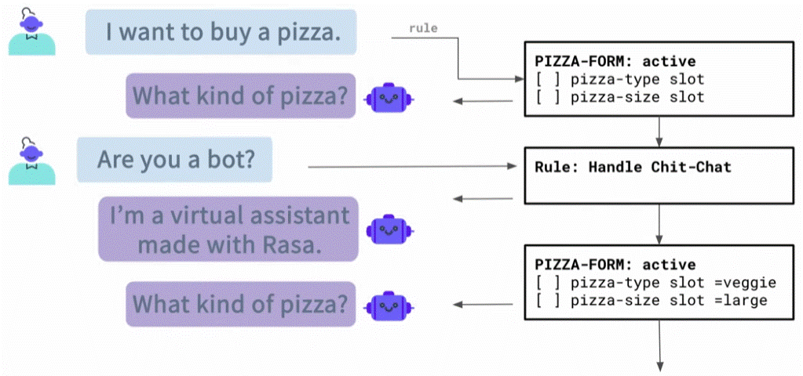
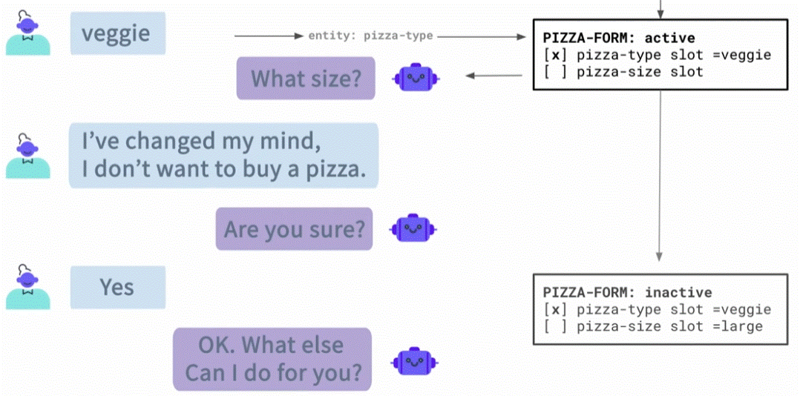

<div align="center">

# **Custom Forms (Slot filling)**
</div>

Custom forms let you handle unexpected user answers and create more flexible, dynamic conversations by controlling exactly how and when slots are asked, validated, or skipped. makes the  conversations flexible, letting you handle surprises and guide users dynamically.

## Examples of dealing with Un-Happy path

### 1. Here the conversation is disturbed by asking out of the form questions - we want to answer it and go back to fill the form:



To do this we configure an extra __Rule__:
```yaml
    - rule: Interruption in Pizza Form
      condition:
      # Condition that form is active
      - active_loop: simple_pizza_form
      steps:
      # The case of an intent 'bot_challenge'
      - intent: bot_challenge
      - action: utter_iababot
      # Return to form
      - action: simple_pizza_form
      - active_loop: simple_pizza_form
```
This rule triggered if only if the form was interupted (active_loop). and there is an intent (bot_challenge) that follow by the action (utter_iamabot). that will answer the intrupt question. once is done, we mention that the form is active and continue from there ( action: simple_pizza_form and active_loop: simple_pizza_form)

__*note__ in order for it to work you have to add intent (bot_challenge).

### 2. Stoping the form if the user ask - canceling the form



we want not just stopping the form but also to get the user confirm. the best way of doing it its by stories (you need more then one). rules cant apply here becouse they build for __one__ set at a time while here we need more then one (intent: stop) and he confirmation (ontent: stop and affirm)

```yaml
    - story: User don't want tp continue form
      steps:
      - intent: greet
      - action: utter_greet
      - intent: buy_pizza
      - action: simple_pizza_form
      - active_loop: simple_pizza_form
      - intent: stop
      - action: utter_ask_continue
      - or:
        - intent: stop
        - intent: affirm
      - action: action_deactivate_loop
      - action_loop: null
```


