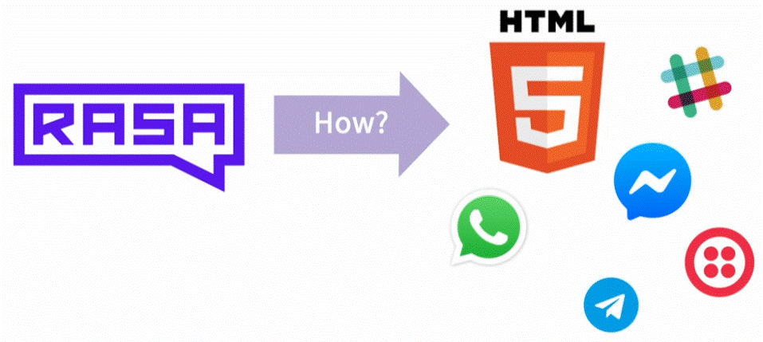
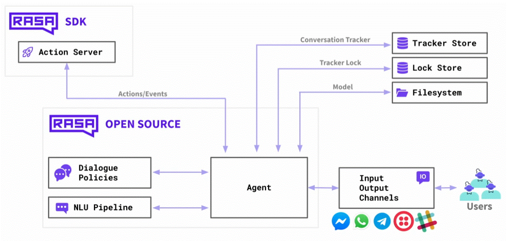
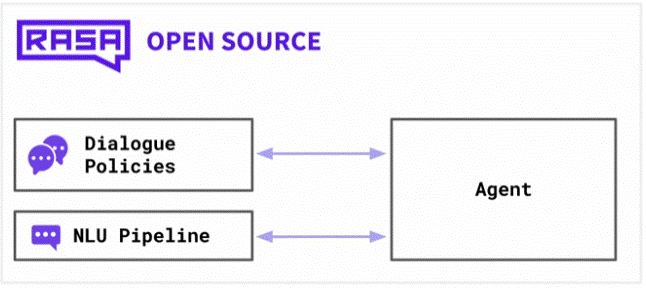
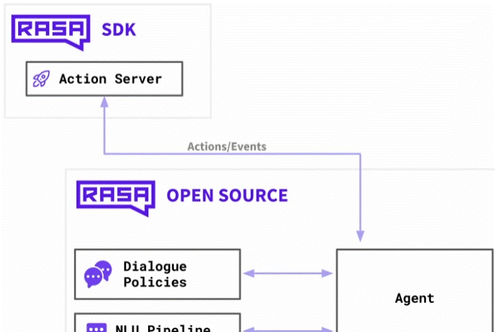
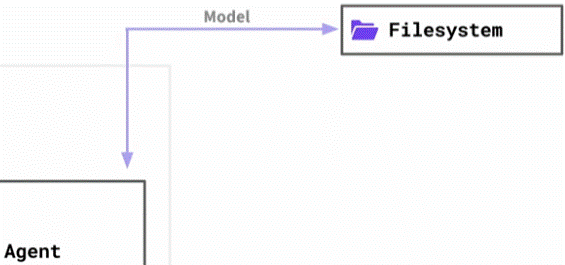
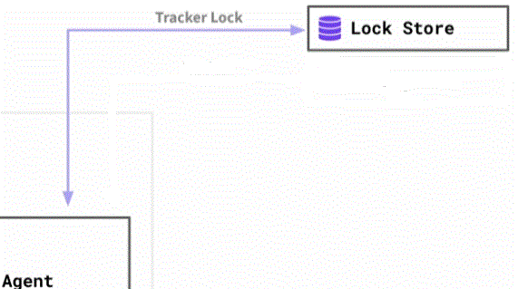
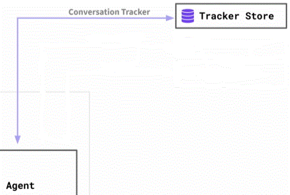
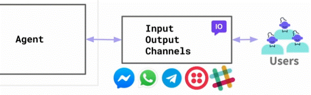
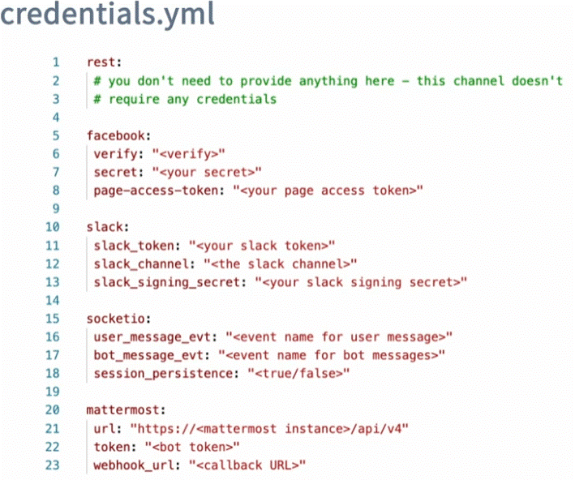
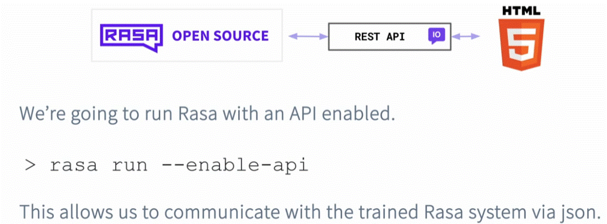

<div align="center">

# **Integration with a Website**
</div>

Integrating the Rasa chatbot with websites, WhatsApp, Facebook messanger, Telegram and other platforms for seamless user interactions.



## The Rasa Architecture
befor diving into the how Rasa comunicate with the "outside world". lets understand the Rasa Architecture.



### Rasa core



In the core, we have the __NLU pipeline__ (predict entities and intents) and also the __Dialogue Policies__ (predict the next action in the conversation).
This two component communicate with an __Agent__.
The __Agent__ "job" is to communicate with different components and make sure they interact properly.

### Action Server

If an __Agent__ wants to handle the next __action__ it might need a custom action in order to reply. the Agent can communicate actions to the __Action server__, which in turn can send Events back.



__*Note:__ in a production setting both of those services (core and Action Server). those services will be "running" on separate __Docker__ containers.

### Filesystem



The __Agent__ need information in a pre-trained model. a pre-trained model contains the __NLU__ and the __Dialogue__ models, but also the __domain.yaml__ file with all of our responses.
This information is typically loaded from disk on startup, but it should be available upfront (all time). 
The __Rasa__ model can also train new models.
__*Note:__ in production Rasa can also be configured to save the model on a storage outside (like S3).

### Lock Store

Stroe for tracking of a conversation.



Rasa use a ticket lock mechanism to ensure that incoming message for given conversation ID are processed in the right order. and it also lock conversation on messages are actively processed. this means, that multiple rasa service could run in parallel as replicate services. And client don't necessary need to address the same node when sending a messages for a given conversation ID.

__*Note:__ When running on a laptop, we use an in-memory Lock Store, but in production, this is typically handled by a Redis store. This is super important if you have many Rasa servers running in parallel, because Redis makes sure all servers follow the correct order for a single conversation.

### Tracker Store
This is where the asistant conversation will be store. 


__*Note:__ When running locally, Rasa uses an in-memory store. In a production setting, it is recommended to use a database to keep track of all conversations with all users. Rasa supports Redis, PostgreSQL, MongoDB, and DynamoDB out of the box, and you can also write your own custom connector to use other databases.

### Input Output Channels

The __Agent__ communicate with this input/output component. that allow us to communicate with many different channels.



We can have multiple input/output channels all communicating with the same Agent (e.x. same agent on Slack as for the WebSite). the channel in that sense independent of the rest of the Rasa stack.
Out-of-the-box, Rasa comes with support for: Facebook messenger, Whatsapp, Telegram, Twillio and Slack.

If you want to use any of those platforms you need to configure the credentials.yml file so that you can communicate with the messenger provider. each provider tents to require slightly different credentials that been "passed" throw the __credentials.yml__ file.



#### rest channel
The REST channel in Rasa allows your bot to communicate with any client by sending and receiving messages through simple HTTP requests.
This channel is connecting using a __REST API__.

This option turns on the Rasa HTTP API, so other programs can talk to your bot.
It allows to send messages from:
* websites
* mobile apps
* Postman
* JavaScript
* Python
* any tool that sends HTTP requests

Without __--enable-api__, you cannot call endpoints like:
* /webhooks/rest/webhook (send/receive messages)
* /model/parse (NLU parsing)
* /conversations/... (view history)



__Example 1:__
this example explore the way the __REST API__ work;

We turn-on the __API__ by using the command (on the terminal):
```terminal
rasa run --enable-api
```
On the Browser (This gets the version of rasa and the minimum version that the models that are compatible version):
```
http://lochalhost:5005/version
```

__Example 2:__
Assuming that rasa listen on: http://localhost:5005
this example will send a message "hi there"

First activate the Rasa __API__:
```terminal
rasa run --enable-api
```
Sending the message:
```terminal
curl -X POST http://localhost:5005/model/parse \
  -H "Content-Type: application/json" \
  -d "{\"text\":\"hi there\"}"
```
This sends the text "hi there" to Rasa so it can understand it.
A reply example:
```json
{
  "text": "hi there",
  "intent": {
    "name": "greet",
    "confidence": 0.9996106028556824
  },
  "entities": [],
  "text_tokens": [
    [0, 2],
    [3, 8]
  ],
  "intent_ranking": [
    { "name": "greet",            "confidence": 0.9996106028556824 },
    { "name": "affirm",           "confidence": 0.00009714787302073091 },
    { "name": "mood_unhappy",     "confidence": 0.00008264237112598494 },
    { "name": "mood_great",       "confidence": 0.00004373480987851508 },
    { "name": "buy_pizza",        "confidence": 0.00003553136775735766 },
    { "name": "bot_challenge",    "confidence": 0.000032198884582612664 },
    { "name": "buy_fancy_pizza",  "confidence": 0.000019189261365681887 },
    { "name": "inform",           "confidence": 0.000018062266462948173 },
    { "name": "deny",             "confidence": 0.000015227644325932488 },
    { "name": "goodbye",          "confidence": 0.000015213927326840349 }
  ],
  "response_selector": {
    "all_retrieval_intents": [],
    "default": {
      "response": {
        "responses": null,
        "confidence": 0.0,
        "intent_response_key": null,
        "utter_action": "utter_None"
      },
      "ranking": []
    }
  }
}
```

__Example 3:__ 
Using a widget that already exsist to comunicate with Rasa. this widget is a chatwidget (__Catroom.js__)
to enable the communication we have to set our backend (Agent) to allows ANY website to call your Rasa server (not in production)

To do that we use the __--cors="*" flag__ (Cross-Origin Resource Sharing) that allow all conections.
```terminal
rasa run --enable-api --cors="*"
```

__*Note:__ here is an example for __safer production version__ of the command:
```terminal
rasa run \
  --enable-api \
  --cors="https://my-website.com" \
  --ssl-certificate /etc/ssl/cert.pem \
  --ssl-keyfile /etc/ssl/key.pem
```
Create an __HTML__ file (opens the chatroom):
```html
<!DOCTYPE html>
<html lang="en">
<head>
    <meta charset="UTF-8">
    <meta name="viewport" content="width=device-width, initial-scale=1.0">
    <title>Rasa Chat</title>
    <link rel="stylesheet" href="Chatroom.css">
</head>
<body>
    <div class="chat-container"></div>

    <script src="Chatroom.js"></script>
    <script type="text/javascript">
        // Generate a fixed conversation ID for this session
        const conversationId = "user_session_1"; // you can generate a random one per user

        var chatroom = new window.Chatroom({
            host: "http://localhost:5005",       // Rasa server endpoint
            title: "Chat",
            container: document.querySelector(".chat-container"),
            welcomeMessage: "Hi, I am your assistant. How may I help you?",
            conversationId: conversationId,      // ensure messages belong to same conversation
        });

        chatroom.openChat();
    </script>
</body>
</html>
```
Download the files (chatroom) __Chatroom.js__ and __Chatroom.css__ (to the same folder as the HTML file).
on __Powershell__
```terminal
Invoke-WebRequest -Uri "https://cdn.jsdelivr.net/npm/@scalableminds/chatroom@0.12.0/dist/Chatroom.js" -OutFile "Chatroom.js"
Invoke-WebRequest -Uri "https://cdn.jsdelivr.net/npm/@scalableminds/chatroom@0.12.0/dist/Chatroom.css" -OutFile "Chatroom.css"
```


__Enable the API__:
```terminal
rasa run --enable-api --cors "*"
```

Sart a small __WebServer__ that able to host the __HTML__ file (in the terminal on the same folder the HTML file is):
```terminal
python -m http.server
```

__Open__ a browser:
```
http://localhost:8000/
```

## Extra

Those __HTML__ files are chatroom's.
1. [Regular](../Rasa_files/chatroom.html)
2. [voice chatroom](../Rasa_files/voivechatroom.html)
