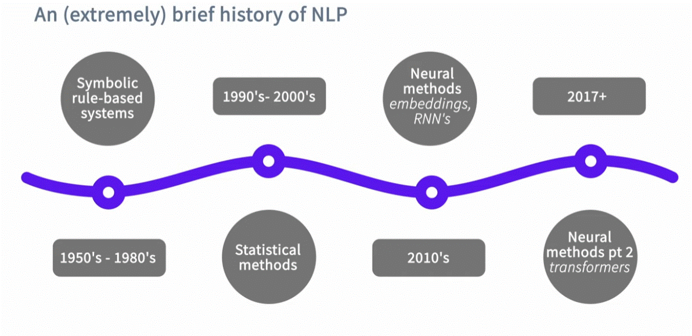

# **Introduction**

# Topics:

  1. what we can do with Rasa
  2. An (externally) brief history of NLP
  3. State machines VS. neural methods
    * Understanding text.
    * Deciding how to respond.
  4. How to make sure conversations work (and improve over time)

Rasa is build to designed to build a specific type of conversation systems:
__Task oriented dialogue systems__

* Task oriented - the user want to accomplish something.

* Dialogue systems - they do (achieve the task) by talking with an automated system in two-way conversation.

# 1. What can you do with Rasa:
* Rasa is a framework that makes it easier to build custom chatbots.
* The core of building a Rasa assisant is __providing examples that your system learn from__;
  - How do people say things? - what the diferante ways people prase what they want.
  - How do conversations go? - what paterns i the system should handle.
* highly customizable and support everithing fromm hobby projects to complex enterprise systems.

# 2. An (externaly) brif history of NLP:

# 3. State mechines vs. neural methods

## Understanding Text
  * NLU = Raw text in, machine-readable information out

we do this using:
  * __Rule-based:__
    - Example: A regular epression that finds and extracts email addresses.
    - You don't need much/any data for these approaches.
    - Thay can run very fast.
    - BUT the're not very good at handling things they haven't seen before.
  * __Neural:__
    - Example: A transformer-based model (e.g. DIET) that sort text into intents based on examples it's been provided.
    - Require traning examples (in general, the more the better).
    - But the're very good at handling things they haven't seen before, making "informed guess".

__A Rasa assistent might use both, but teh neural methods are the core of the framework.__

## Diciding what to do next

  * __Dialog policy__ = Given the conversation so far, what should your assistant say or do next?

    - __Rule-based:__
      - Example: A big dialog tree of all possible paths a conversation can take.
      - This is a traditional approach to dialog and it can work well in some cases.
      - But they can't hand diagressions and are a bit of pain to extend/maintain.
    - __Neural:__
      - A transformer-based model (e.g. TED) that picks the next best turn based on the conversation so far and all the conversations it's been trained on.
      - Require traning examples (in general, the more the better)
      - But this approach let's users have more natural conversations, evev if they say things different order every time.

__* NOTE:__ it is recommended to use both approaches in tandem

# 4. How to make sure conversations work (and improve over time)

  * The Rasa approach is:
    1. flexible, every conversation might be uniqe.
    2. works better the more high-quality traning data you have.
  * How do you make sure conversations work?
    - Manually reviewing and annotating conversations.
  * How do you make sure conversations improve over time?
    - Correct any errors your assistant made in a conversation....then add it to the training data, retrain and redeploy.
    - A Rasa conversational AI system isn't static! It changes and adapt over time.

  __We call this process "conversation-driven development"__
    

