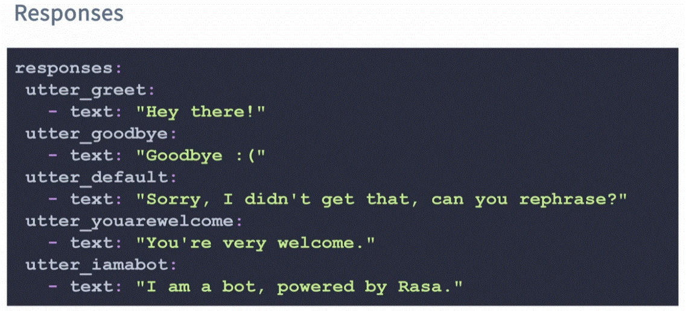
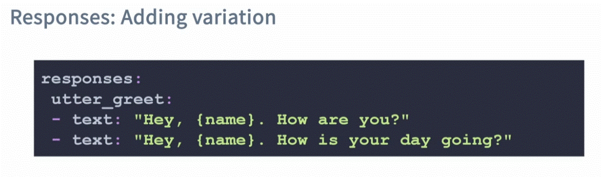
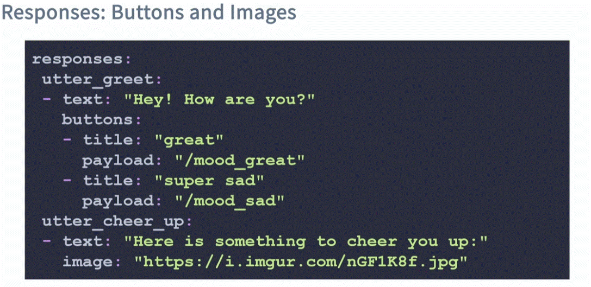
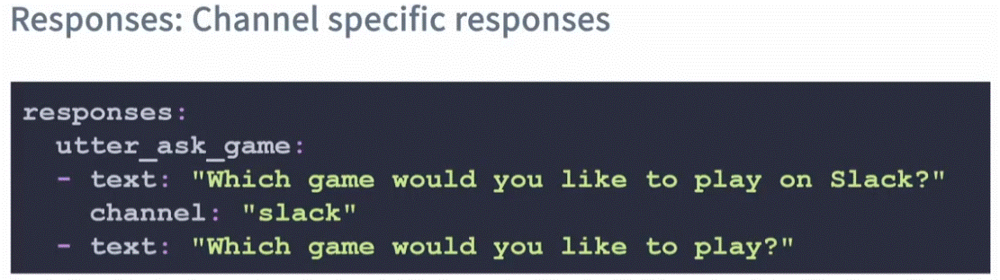
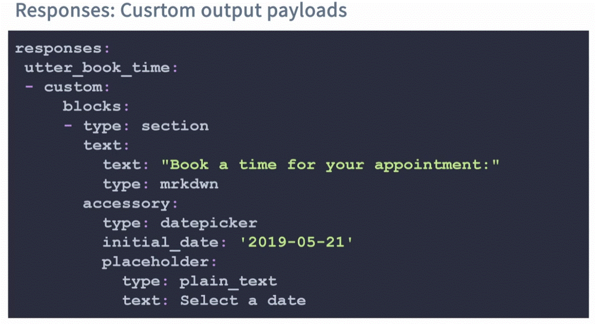
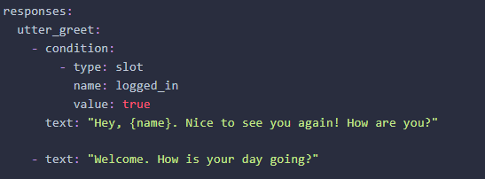
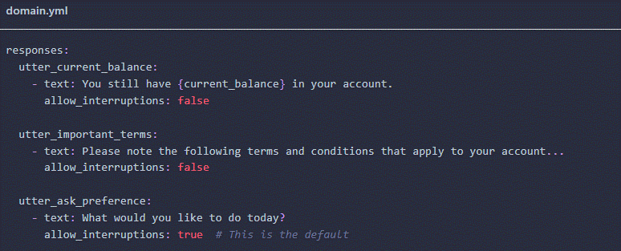
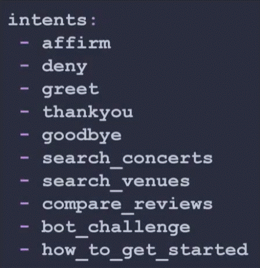

<div align="center">

# **The Domain File (Intents & Responses)**
</div>

# Topics:

  1. What's in a domain file?.
  2. Responses: what your asistant says.
  3. Intents: Categories of things your user say.

# 1. What's in a domain file?.

The domain file is a directory of everything your asistant "knows":
  * __Responses:__ These are the things the asistant can say to users.
  * __Intents:__ These are vategories of things user say.
  * __Slots:__ These are variables remembered over course of a conversation.
  * __Entities:__ These are pieces of information extracted from incoming text.
  * __Forms and Actions:__ These add application logic and extend what your assistant can do.

# 2. Responses:

what your asistant says.




file is a YAML file (as in the pic above). it list the responses. where each response (utter) have his value to reply.

```yaml
    responses:
      utter_name:
        - text: "text of response"
```

__*note__ it is sugested to add a utter for identifying as a bot;

```yaml
      utter_iamabot:
        - text: "I am a bot, powered by Rasa."
```

__Adding variant Responses:__



__* Note:__ when this is triggered, one of the responses will be randomly selected.

__* Note:__ {name} will be filled with the value of the name (in a slot). will return "None" untill it's filled.

__Buttons and Images:__
Adding aditional functionality to the assistant. we can add buttons and images.



__* Note:__ buttons and images will be rendered depending on the channel you use (the rasa will send JSON with this information).

__Channel specific responses:__
If the assistant run throw multiple channels using multiple connecters. you can set the response base on the channel the user interacted.



__Custom output payloads:__
As long as it in JSON format. you can upload custom payloads.



## other responses

__Condition:__



__Voice-Specific Response Properties:__
For voice assistants, you can control specific behaviors of individual responses using voice-specific properties.



# 3. Intents
Categories of things your user say. the NLU map the intents to the training data (containing ways user may express the intent).



__*Pro tip__ Start with the fewest intents possible. you can add or change intents at any time.

