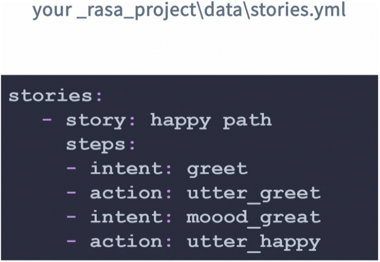
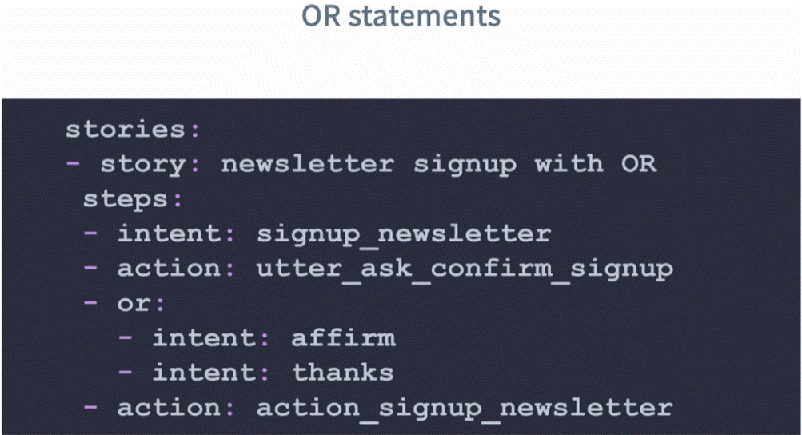
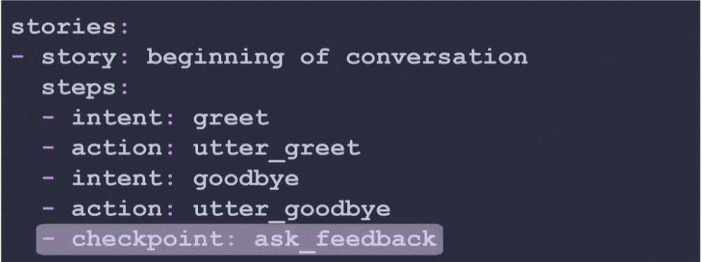
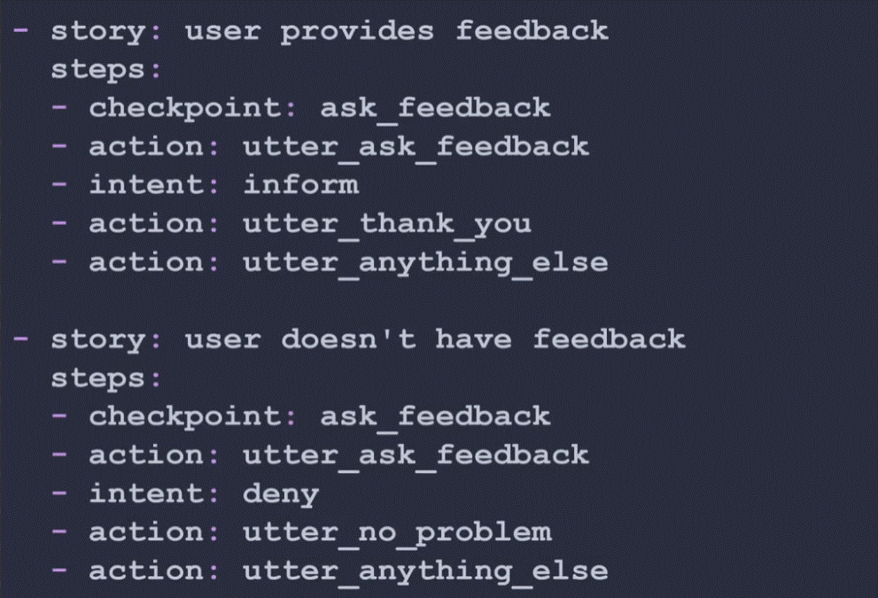
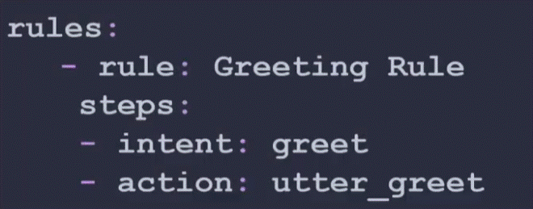
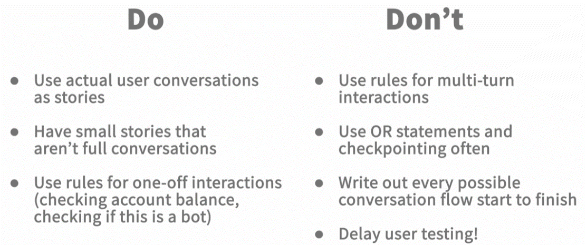
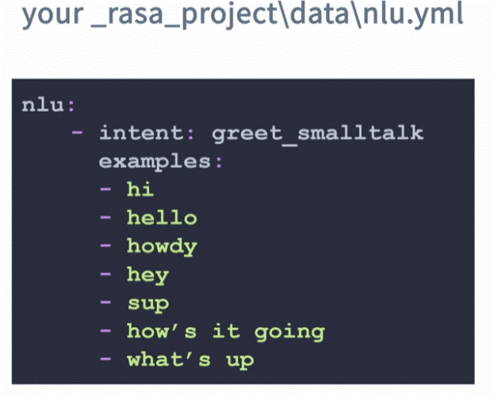
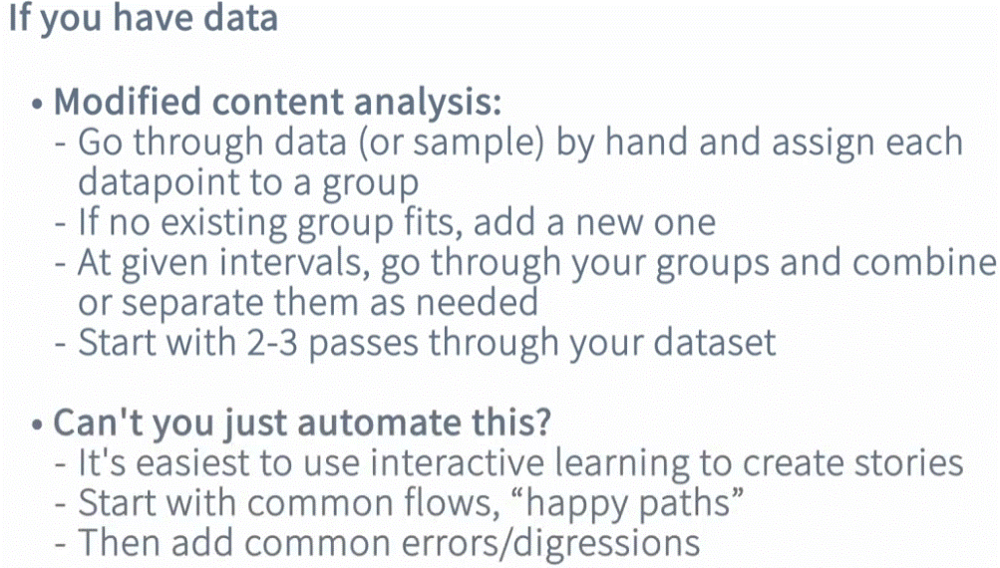
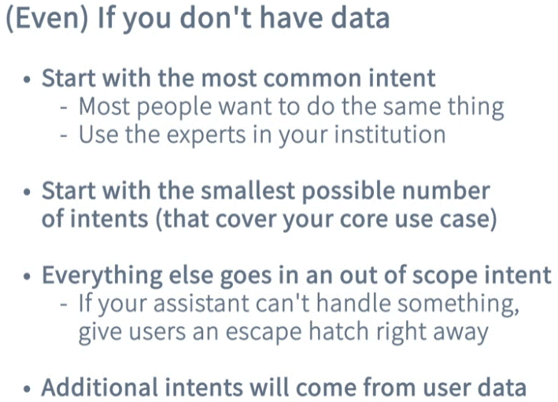

<div align="center">

# **Training Data & Rules**
</div>

# Topics:

  1. What is training data for a Rasa assistant?
  2. Stories.
  3. Rules.
  4. Intens (examples)
     - Where to start if you already have data.
     - Where to start if you don't already have data.

# 1. What is training data for a Rasa assistant?

What is "__data__" for Rasa project?
  * The text data used to pretrain any models or features you're using (e.g. language models, wrod embaddings, etc,)
  * User-generated text - what the user usualy type (ex. what are the differante ways your customers say "hello").
  * Pattens of conversations - pattern that happen in a conversation (e.g.if a user say "hello" to the assistanse, what the assistant will replay).

Examples where we can get data:
  - Customer support logs (assuming data collection & rules is covered in the privacy policy).
  - User conversation with our assistant (__NOTE__ this is the __best__ place to find data - from users interacting with  our asistsnt).

#  2. Stories

Stories - training data to teach the asistant what it should do next.

If you have a storie discribing the same pattern the conversation went. the pattern that used in the storie will be triggered.
It, however, you have a pattern of conversation the assistant did'nt seen before, it will look at all stories and guess what it most likely fit (which storie). if it not sure which storie fit (under a trash level we set) it will start a pallback.

__how to set patterns (stories):__
  - __If you have conversation data__:
    - if you have conversations that you trying to model, start with those patterns.
  - __If you dont have conversation data.__ generate your own conversational patterns:
    - It's easiest to use __interactive learning__ to create stories - command line interface tool to do interactive learning where you pretend to be both the assistant and the user having conversations.
    - Start with common flows, "happy paths" - conversation you want your user have every time.
    - Then add common errors/digressions.
  - __Once your model is trained__:
    - Add more data from user conversations.
   
__how a Stories look like__



```yaml
    stories:
      - story: happy path # Define the story name (any desctiption name)
        steps:
          - intent: greet
          - action: utter_greet
          - intent: mood_great
          - action: utter_happy
```
In the pattern of the conversation (under steps):

  ### __intent__ - things that user say that the mechine model has detected.
  
  ### __action__ - things that the assistant do.

## __OR statements__
This step (__OR__) means it can match any of these intents (it's affirmed if the intent is "affirm" or "thanks").



## __checkpoint__
A checkpoint is a marker inside a story that allows you to link or continue from one part of a conversation to another (like a shortcut of the story. it help keep it more orginize and less code).




__*Note:__ in Rasa 3.x __checkpoints were removed__. insted you compose story  containing the all "link" stories. 

```yaml
    - story: greet and then ask weather
      steps:
      - story: greet user
      - story: ask about weather
```

# 3. Rules
A way to describe short pieces of conversations that always go the same way.
Rules are like __“if this happens, always do that”__ — a way to tell the bot exactly what to do in specific situations, so it’s predictable and doesn’t guess.



# recomendation for Stories and Rules



# 4. Intens
An intent is __what the user means or wants__ when they say something, like “greet,” “order coffee,” or “deny.”

The __examples__ is the training data for that the assistant can recognize the intent. 



__if you have conversation data:__



__if you DON'T have conversation data:__



## Why to use FEWER intents?
  * __Older style of conversational design:__ you need an intent for everything your user might want to do!
  * __Rasa style (CDD):__
    - You only need to start wih the most popular, important intents & a way to handle things outside them.
    - Continue to build from there if that's what user need (add intents).
  * __Human reasons:__
    - More intents = more training data, maintenance and documentation.
    - More intents = annotations more difficult.
  * __ML reasons:__
    - Transformer classifiers scale linearly with the number of classes.
    - Entity extraction (esp. with very lightweight rule-based systems like Duckling) is often faster. finding specific details (like dates, numbers, or names) in what the user says using Duckling (a lightweight tool that quickly recognizes these kinds of entities).
   
## Parin intents

  * __Don't use intents as a way to store information__ - store information in __slots__.
  * If you have the same tokens (examples) showing up in training data for two intents - __Consider to combine them__

Example: you have two intents:

here we have two intents similar:
```yaml
    book_train:
      - One train ticket
      - need to book a train ride
      - A rail journey please

    book_plane:
      - One plane ticket
      - Need to book a plane ride
```
we can combine them together to one intent:

```yaml
    make_booking:
      - One [train](train) ticket
      - Need to book a [train](train) ride
      - A [rail](train) journey please
      - One [plane](air) ticket
      - Need to book a [plane](air) ride
      - i'd like to book a trip
      - Need a vacation
```
## Training data for an intent

  * __User-generated__ its much beter then __syntetic__ trining data.
  * __Each utterance should unambiguously match to a single intent__ - varify it by using human sorting & inter-rater reliabulity (verified by humans agreeing on its label).
  * If an utterance __is ambiguous__ (may relate to more then one intent - like help me can be as hello or support issue) - Use end-to-end learning insted (the row text as training data without classifying it).
    
    Example:
      - Instead of labeling it with a single intent, you write a story (or rule) where the user message itself is used as the input.
      - Rasa learns “if the user says this (text), do this action”.

  yaml - example:
  ```yaml
    stories:
      - story: help or greet
        steps:
        - user: "Can you help me?"
        - action: utter_ask_how_to_help
```
