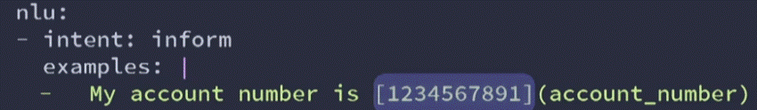
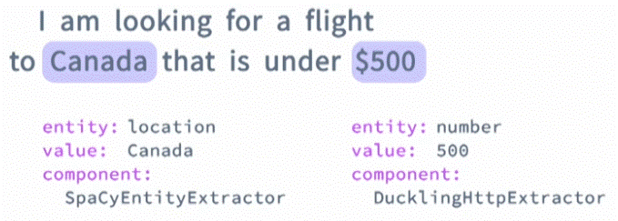
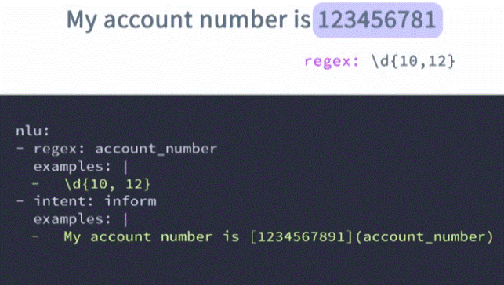
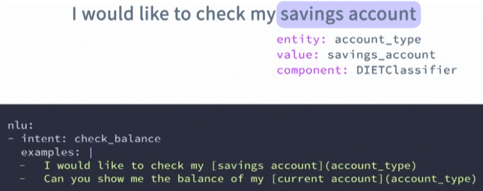
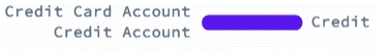
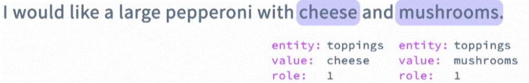
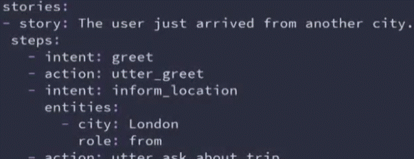

<div align="center">

# **Entites**
</div>


__Entities:__ are structured pieces of information inside of a user message.

An entity can be __any important detail__ that your assistant could use later in a conversation (these are common entities examples):
  * Numbers
  * Dates
  * Country names
  * ......
  * Product names

Example of an entitiy:


## Training data for entity extraction

Training data for entity extraction should be included in the nlu.yml file.



The word that should be extracted as an entity should be inside square brackets ([12345678+1]), and the lable of the entity inside parentheses ((account_number)).

### There are three ways entities can be extracted in Rasa:

1. __Using pre-built models__(without requiering having a load of training data):
   - __Duckling__ -  for extracting numbers, dates, URL, email addresses.
   - __Spacy__ - for extracting names, product names, location, etc'

 

__*note:__ to enable the Rasa assistant to use these models. preferance those in the __nlu__ configuration file.

2. __Using Regex__ - allow define a specific pattern that the entity will watch and follow (e.g. phone number, postcode, etc')

 

 __*note:__ to enable the Rasa assistant to use __Regex__. youll have to define the Regex pattern and included in the nlu.yml file an adithion to some training examples for that specific entity. 

3. __Using machine lerning__ - if there need to extract custom entities.

For example (one of the most powerfull models for entity extracting is __DIETClassifier__):

 

### The output of the entity extraction

The output of the entity extraction is a snippet of JSON which contains the details of:
  - Entity __category__ ("city")
  - Entity __value__ ("New York City")
  - Confidence level
  - The component that extracted the entity


 

 (in this example: the entity "city" value is "New York City" and the extraction method used is "DIETClassifier"

 ## in addition to just extracting entities. Rasa comes with a few aditional features that can help you enhance the entity extraction even more.

 1. __Synonyms__ - map the extracted values to a single standardized value (different than the one extracted).

 

 There are two ways of how __synonyms__ can be added to the Rasa:

   a. adding a new section to the nlu.yml called synonyms. you have to define the actual value that extracted values will have to be map to, and then you need to provide examples of how users might refer to that specific synonym.

 

   b. adding them in line with the nlu training examples all you need to do is add another parameter called "value" which will referance the value that extracted entities will have to be map to.

 

 __*note:__ synonyms mapping happend after the entities are extracted, which means you need some training data to enable the assistant to extract entites first.

 2. __Lookup tables__ - list of words that can be used to generate case sensitive regular expression patterns. with __lookup tables__ you can enhance entity extraction for details that have a set of known possible values.

 

 3. __Entity Roles and Groups__ - allow you to add more details to your entites.
    
    a. __role__ - a label that tells the bot the specific purpose or function of an entity in a sentence.


   ```yaml
   nlu:
   - intent: book_a_flight
     examples:
     - i am looking for a flight from [Nw Yrk]{"entity": "location", "role":"origin"} to [Boston]{"entity":"location", "role":"destination"}
```

    
   b. __groups__ - allow you to put extracted entities under a specific group.



   ```yaml
   nlu:
   - intent: order_pizza
     examples:
     - i would like large pepperoni with [cheese]{"entity":"toppings", "group":"1"} and [mushrooms]{"entity":"toopings", "group":"1"}.
```

   __*note:__ an importing thing about roles and groups is that you habe to include quite a few different examples for your assistant to reallyu learn. so make sure to include different examples of different variations of role and groups.

   __Entity Rols can also be configured to influance the flow of the conversation__ -  to do that you need to include roles in your training data stories. 

   
