

# **Slots**

## Slots are your assistant's memory

Slots enable your assistant to store important details and later use them in specific context.

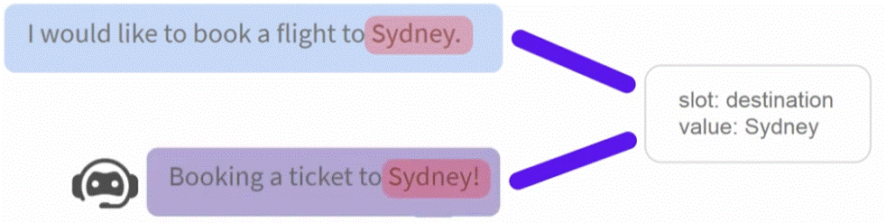

## Configure slots
Slots are defined inside of the domain.yml file

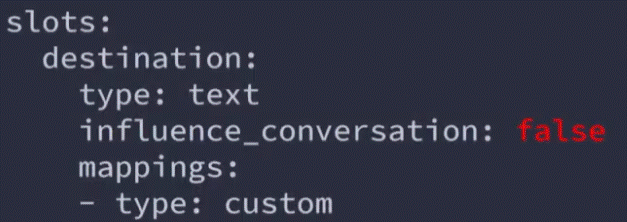

The slots includes:
  - __Slots name__ (in the ex."destination")
  - __Slots type__ (in the ex. text)
  - __influence_conversation__ - a parameter describe wheter the slots influence the conversation (in the ex. false).
  - __mappings__ (in the ex. custom).

### There are two main ways how slots can be set in process;
  1. __using NLU__

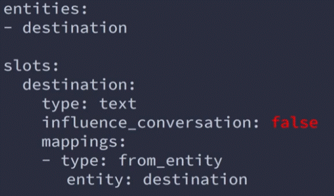

depending how you configure the slots mappings. slots can be set using values of the extracting entities. in other cases slots may be set using specific values if a certain intent has been predicted or similar.

  2. __Using custom actions__ (look on page 9 - custom actions).

### Influencing the conversation
Slots can be configured to influence the flow of the conversation. how and when this should happen depends on the type of slot.

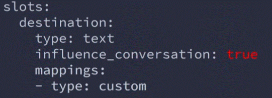

__* Note__ the way slots influence the conversation depends on the type of the slot.

__influence_conversation = true__
influence_conversation = true - configuration defines that the slot will influence how the dialogue management model makes the prediction for the next action. Depending on the type of the slot the flow can be influenced by the value of the slot or whether the value of this slot is present.

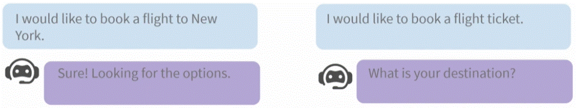

__influence_conversation = false__
influence_conversation = false - configuration defines that the slot would not influence the flow of the conversation and should only be used for storing the value of the slot.

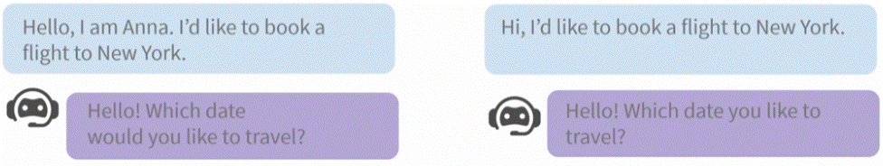
In this example: the slot of the name ("Anna") is not influencing the flight booking.

__Configureing the stories__
If you configure spesific slots to influence the conversation, you need to add include them in the training story to teach the assistant how to frive the conversation base on the behvior of the slots. this can be done by including steps "slot_was_set" inside the training story and providing the detailes about the slots and the values that should be set at specific steps of the conversation.

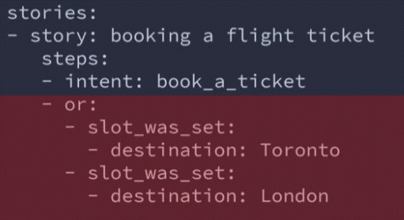

## Slot mappings
Slots mapping allow to define how each slot will be filled in. 
Slot mappings are applied after each user message.

Example:

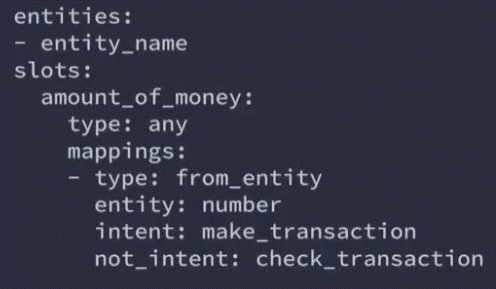

__(explanation of the script)__ - we have a slot name ""amount_of_money". and we have a mapping configuration for it, the tyoe of thes mapping is "from_entity" (mean the slot will fill in with the value extract from an entity). the entity name is under (entity: number). we also have two aditional constrains, an intent (make_transaction) which means this slot mapping will be applyed only if that specific intent is predicted. where the "not_intent" (check_trasaction) - if intent check_trasaction is predict, this mapping wont be applyed.

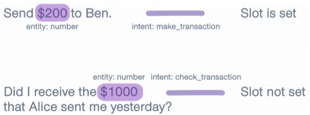
the first number will be filed. since the intent is "make_trasaction". while the second won't be filed because the intent is "check_trasaction" and it under +not_intent" mapping.

## Slots mapping type available in Rasa

### from_entity
The from_entity slot mapping fills in the slots based on the extracted entities.

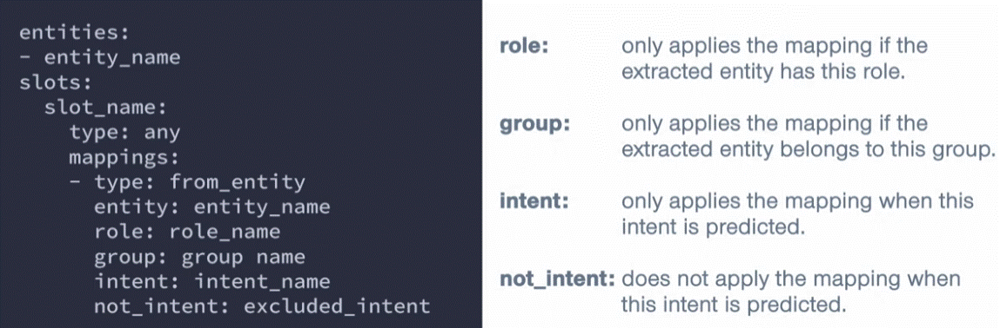

### from_text
The from_text mapping will be use the text of the user message to fill in the slot (uses the text of lates user message to fill the slot)
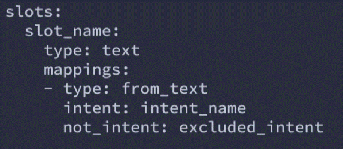

### from_intent
The from_intent slot mapping fills in the slot a specific defined value if a specific intent is predicted.
This slot mapping is based on the predicted intents. the slot will be filled with a specific pre-defined value (which need to defined when you configure the slot mapping) if a specific intent as been predicted. 

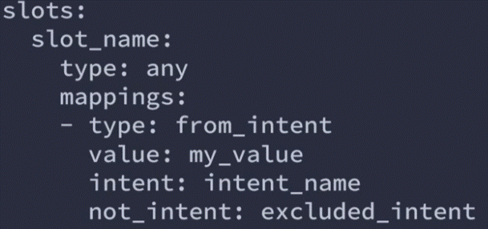

### from_trigger_intent (work on forms)
The from_trigger_intent mapping will fill a slot with a specific defined value if a form is activated by a user message with a specific intent.

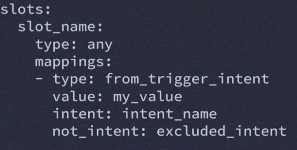

### custom (mapping)
If none of the predifined slot mappings fit, we can create a custom slot mapping using slot validation actions.

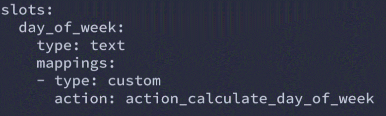

## Slot type

### text
Slot tyoe text can be used to store any text information. it can influence the conversation based on whether or not the slot has been set.

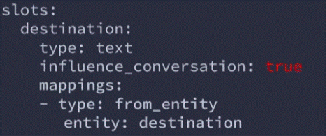
 __*note__ the actual value of the slot will have __NO__ influance on how the conversatin goes. only the present or the absent of a specific detail will influance on how the conversation goes (if the slot is configured to influence the conversation - influence_conversation = true).

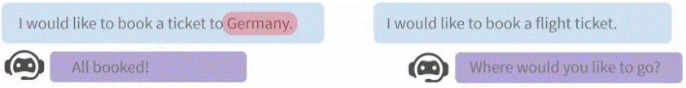

### boolean
Slot type boolean can be used to store information that can get the value True ot False.

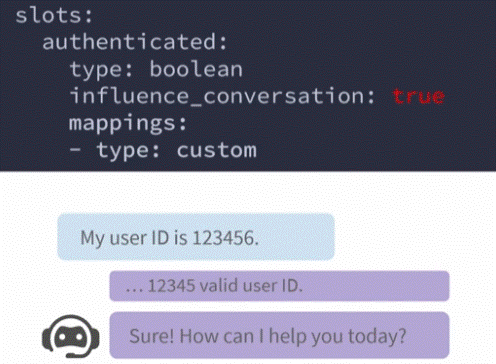
(in this example. the slot walidate if the user has permision to proceed)

### categorical
Slot tyoe categorical can be used to store values that can get one of the possible N values.

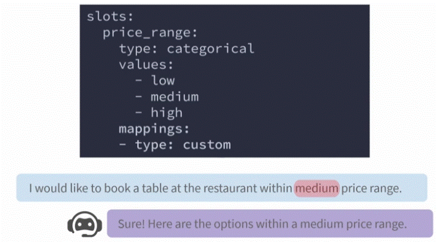

### float
Slot tyoe float can be used to store numerical values.
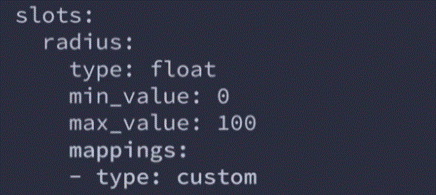
__*note__ in this example the float as a min and max value. if the user provide a value lower then min_value - the min_value will be be set to the min_value (and the same to the max_value).
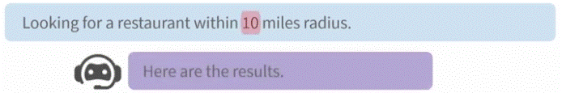

### list
Slot type list can be used to store a list of values. when configured, only the presence of the list can have infulence on the flow of the conversation.

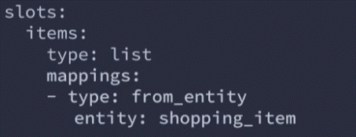

__*note__ the number of values in the list or its content dont influence the conversation flow.
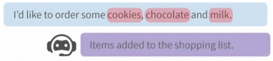

### any
Slot type any can be use to store any arbitrary values.
Slots of this type don't have any influence on the conversation flow, which mean that the value and the presence of the slot doesn't have any infuance on how the conversation goes.

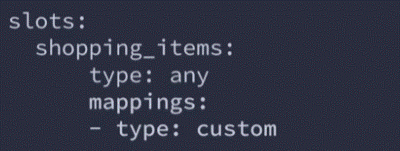
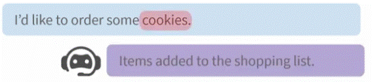
__*note__ this slot will never influence on how the conversation goes. which mean this type of slot is the __best__ to simple store the values that you like the assistant to have the access to.

## initial_value
you can set a default value to the slot by configuring the initial_value parameter. the value will be assigned to the slot from the beggining of the conversation and can be reset later on by NLU or custon actions.

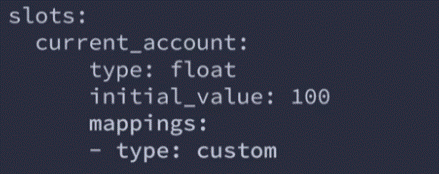
