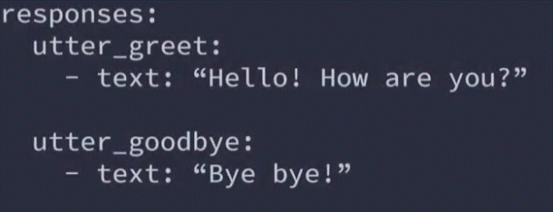
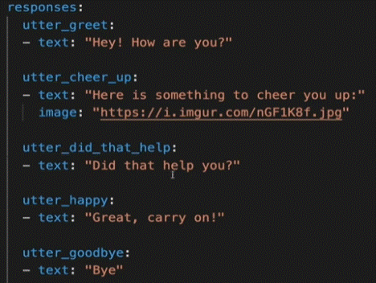
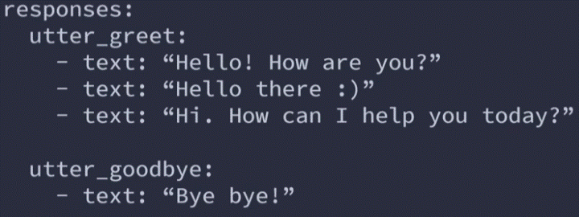
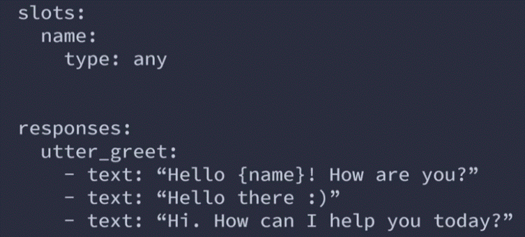
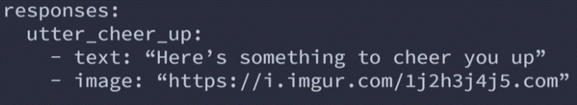
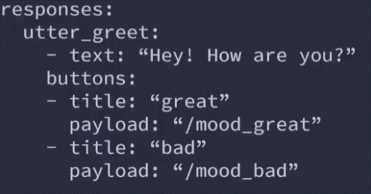
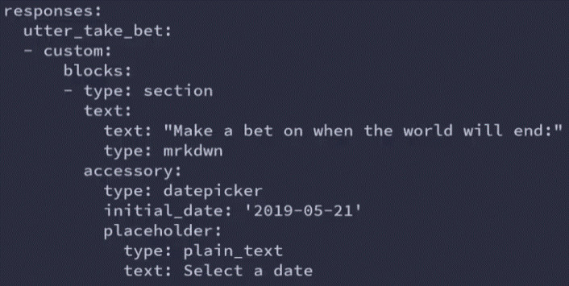
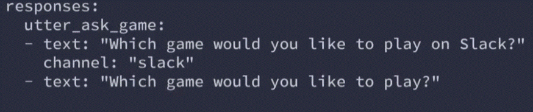
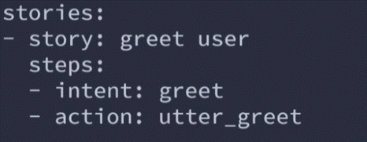

# **Responses**

Responses are simple messages that the assistant can send back to the user without running custom actions or returning aditional events.

To define a response there need to create a response template.

#### response templates are defined in the domain.yml file, insode the section called "responses:" (can difine as many responses you like).

__*note:__ a response as to come with a lable that as to start prefix "utter" (this how the assistans can distinguish response template from other possible reponse types)

the last part of the response template is the actual response. it has to start with the prefix "text" and after that you define what ever text you would like the assistant to send back to the user when this specific response as been predicted.

### Creating multiple responses
You can include more than one possible response for a specific template. Rasa wil then randomly select which response to pick.

### Using variables
you can create more dynamic responses by including slots in the responses.

__*note:__ if the slot is not been set. Rasa will fillit with the "None" value.

### Including images
you can make the responses more engaging by including the URL's of the images you'd like to be included in the responsees.
How they will be rendered depends on the fronend you use.

### Adding buttons
you can enrich the assistant responses by including buttons for specific options. you can configure the text that is visible on the buttons as well as the payload that is being sent to Rasa after a specific button is pressed.

__title:__  define the text on the button the user will see.
__payload:__ the information that will be sent to the rasa backend on pressing that button ( can send intents, entites).

### Custom payload
You can get your assistant to send a custom payload to the frontend.

### Channel specific responses
You can define responses that will be sent to a specific output channel.

__*Examples of channels:__ slack, facebook, telegram, twilio (whatsapp), webchat.....

## Training the assistant to use responses
To enable the assistant to actually use the defined responses, they need to be included in the training stories.

For example:

