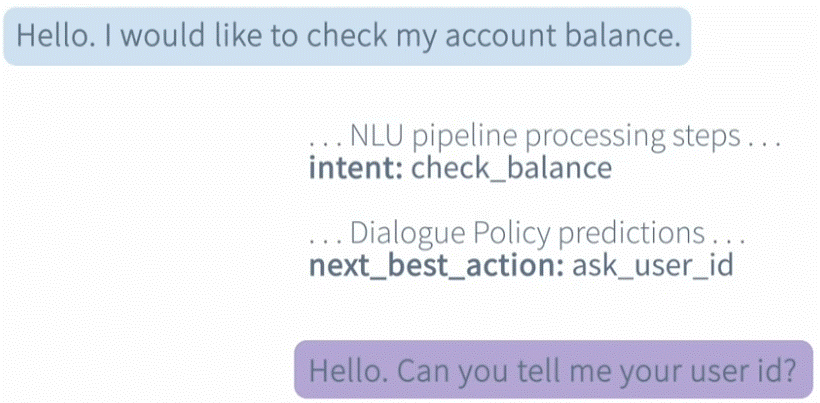
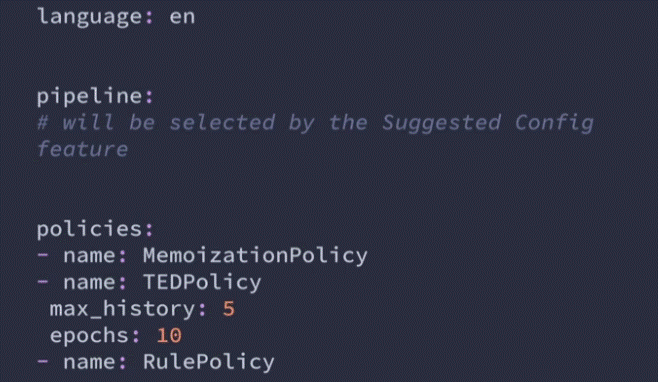
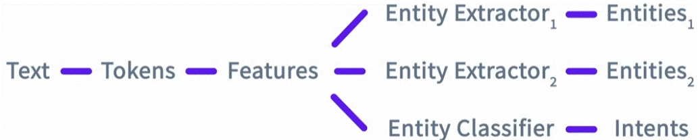
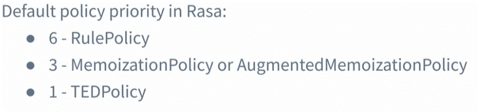

<div align="center">

# **Pipeline & policy**
</div>

When a user sends a message — Rasa does two main things:

  1. __Understands__ what the user means (NLU).
  2. __Decides__ how to respond (Core).

These two parts are handled by:

  * __Pipeline__ → for understanding messages (extract the __Intent__ and __Entities__).
  * __Policies__ → for deciding what to do next.


    
__Policies__ and __Rules__ are what make your bot smart in deciding what to do next.






## NLU Pipline

define the steps user message will be passed through until a decision (understaning) on what the user's messgae in about.

      pipeline:
        - name: WhitespaceTokenizer        # 1. Breaks text into words - ["Book", "a", "flight", "to", "New", "York", "tomorrow", "."]
        - name: RegexFeaturizer            # 2. Detects patterns like emails or numbers
        - name: LexicalSyntacticFeaturizer # 3. Adds info about words (like prefixes)
        - name: CountVectorsFeaturizer     # 4. Converts words into numbers (vectors) so the model can do math with them.
        - name: DIETClassifier             # 5. Learns to predict intent & entities
        - name: EntitySynonymMapper        # 6. Maps synonyms (e.g. “NYC” = “New York”)

__*note:__  
  1. The pipeline is a step-by-step process that turns a user’s message into meaning. so the order they place can matter).
  2. the default piplne is good for most bot cases. you mite change the pipline in specific cases ( e.x. if you want the bot for other language then english)

### pipline components:
In order to "understand" the user message it must follow those steps (convert the message to a language that Rasa can work with):
  * __Tokenizing__ - seperate tokens of the user input (e.g words ["Book", "a", "flight", "to", "New", "York", "tomorrow", "."]) - in the example above WhitespaceTokenizer.
  * __Featurizer__ - extracting features from the Tokens - in the example above RegexFeaturizer,LexicalSyntacticFeaturizer and CountVectorsFeaturizer
  * __Classifiers/Extractors__ - models used to assign a label to the user's input. learn to predict the intents and entites - in the example above DIETClassifier (it does both - find intent and entities). but you can __add__ more extractors for getting more entities - e.g "__DucklingEntityExtractor__" - will extarct dates and numbers in more acurate way.



## Policies
Training policies are techniques the assistant uses to decide on how to respond back to the user.
__*Note:__ you can add many policies to the policies list. the policy that will get the higher matching value will be applyed.

### Policy priorety
the priority of the policies will determinate which policy the assistant will follow in case the prediction the next best action with the same accuracy,  the decigion is been made base at the priority (folow the policy with the higher policy priority value).

__*Note__ priority level are set by defualt - not recomended to cange them.



### 3 main policies:
  1. __RulePolicy__ - Handles hard-coded rules in your bot. explicitly tell Rasa to always do, regardless of probabilities (e.g. When user says hello, always respond with utter_greet)

```
    policies:
        name: "RulePolicy"
        core_fallback_threshold: 0.3
        core_fallback_prediction: true
        restrict_rules: true
        check_for_contradictions: true
```

```
     rules:
      - rule: Greet the user
        steps:
      - intent: greet
      - action: utter_greet
```

  2. __MemoizationPolicy__ - Memorizes frequent conversation patterns from your training stories. Works __well for short and deterministic conversations__.
  3. __TEDPolicy__ - This is the machine learning policy that predicts actions based on conversation context. Predicts the most likely next action, even for new combinations not seen in stories.

