<div align="center">

# **Custom Actions**
</div>

__Custom actions__ are Python functions you write to make your bot do something dynamic — like calling an API, querying a database, or performing logic — before sending a response back to the user.

Here are some examples for using custom actions:
  * Send an Email
  * Make Calendar appointment
  * Fetch relevent information from database
  * Check information from API
  * Calculate something specific

__Custom actions__ are deployed __outside__ the Rasa. it runs as a service seperate to the Rasa (it mean we need to run 2 servics if we want to use custom action).

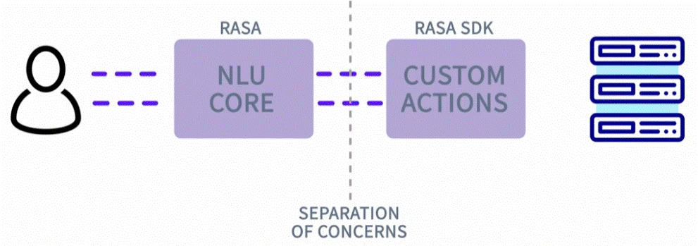

## Custom action File structure


The custom action i iplement as a python class. it has the following parts:
1. import Rasa librery - alloweasyly define a custom action.

   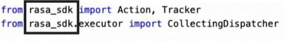

2. class definishion - it implimating the class imported from the rasa class sdk

   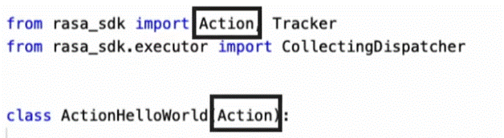

   the name of the class (ActionHelloWorld):

   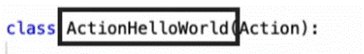

3. inside the class there 2 methods (def):
   a.  firest method (def) called name. gives name to the this custom action (the name is __important__ because we use it in stories, domain, rules).

   

   b. second method called run. contain the python code we want to run when the custom action is triggered. here you run every custom python code that fit the use case.
     the method will recive information from the rasa NLU service and send any information back (to the RASA NLU service).

   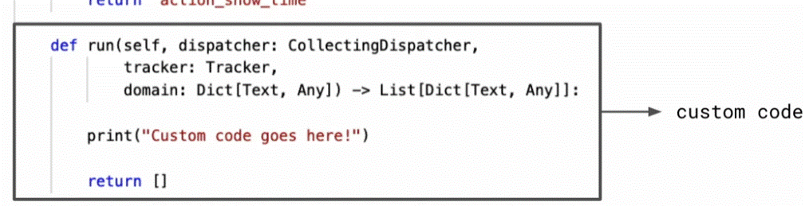

   __explain the Run Method recives__

   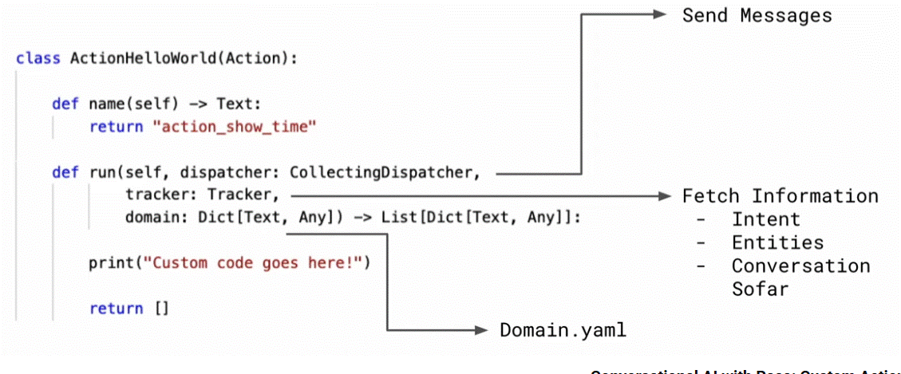

   * __Send message__- a dispatcher (CollectingDispatcher). this allow to send messages back to the user.
   * __Fetch Information__ - using tracker. it contain relevent data that was extract from the conversation so far (intents, entities, slot values...)
   * __domain.yaml__ - the custom actions will have access also to the data defined in the domain.yaml file.

## Example 1
in this example the custom action should return the current time in a specific location.

   

__step 1:__ Inside the __nlu.yml__ file;

    add an intent (inquire_time);

```nlu.yml
- intent: inquire_time
  examples: |
    - what time is it?
    - what time is it in [Amsterdam](place)?
    - what time is it in [London](place)?
    - tell me thetime in [Lisbon](place)
    - what is the current time in [Berlin](place)
    - what time is it in [amsterdam](place)
```
  adding a lookup table (for later use);

```nlu.yml
- lookup: place
  examples: |
    - brussels
    - zagrev
    - london
    - lisbon
    - amsterdam
    - seattle
    - tel-aviv
```
__step 2:__ Inside the __rules.yml__ file (setting role to that activate the custom action (action: action_tell_time) when ever the intent "inquire_time" is triggered);

```rules.yml
- rule: Tell the time
  steps:
  - intent: inquire_time
  - action: action_tell_time
```
__step 3:__ inside the __domain.yml__ we need to configure the domain the for the custom action to "work" (add the intent, entities, custom action  we created)

Adding the intent "inquire_time" (under intents:)

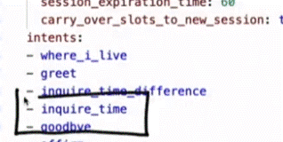

Adding entity - place (under entities):

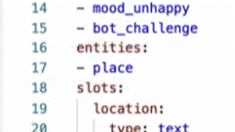

Adding the __custom action__ to the list (under actions)

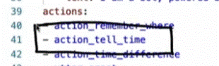

__step 4:__ to be sure we detect the objects properly we set in the __config.yml__ file (we add a RegexEntityExtractor that is using lookup tables)

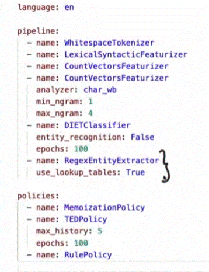

__step 5:__ The __custom action__ file (actions.py - under actions folder)
creating a python file for the code for the custom action.

```actions.py
from typing import Any, Text, Dict, List

import arrow
# import datapreser
from rasa_sdk import Action, Tracker
from rasa_sdk.executor import CollectingDispatcher

city_db = {
    'brussels': 'Europe/Brussels',
    'zagreb': 'Europe/Zagreb',
    'london': 'Europe/Dublin',
    'lisbon': 'Europe/Lisbon',
    'amsterdam': 'Europe/Amsterdam',
    'seattle': 'US/Pacific',
    'tel-aviv': 'Asia/Jerusalem',
}

class ActionTellTime(Action):

    def name(self) -> Text:
        return "action_tell_time"

    def run(self, dispatcher: CollectingDispatcher, tracker: Tracker, domain: Dict[Text, Any]) -> List[Dict[Text, Any]]:
        current_place = next(tracker.get_latest_entity_values("place"), None) #  gets the "place" if its empty it will fill with "None" 
        utc = arrow.utcnow()  # get current UTC time

        # if current_place is empty it return a utc time - a fallback
        if not current_place:
            msg = f"It's {utc.format('HH:mm')} utc now. You can also give me a place."
            dispatcher.utter_message(text=msg)
            return []

        # if current_place not found in the database - a fallback
        tz_string = city_db.get(current_place.lower(), None)
        if not tz_string:
            msg = f"I didn't recognize {current_place}. Is it spelled correctly?"
            dispatcher.utter_message(text=msg)
            return []

        # Convert utc to the timezone of the city
        local_time = utc.to(tz_string).format('HH:mm')
        msg = f"It's {local_time} in {current_place} now."
        dispatcher.utter_message(text=msg)

        return []
```

__step 5:__ configure the action endpoint in the __endpoint.yml__ file - untcoment the lines as show bellow;

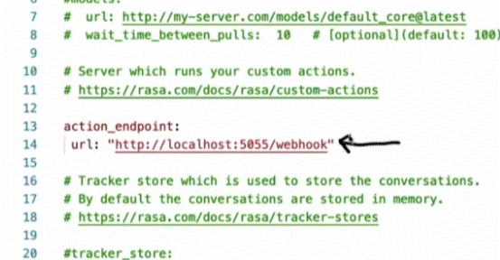

__*Note__ this run the custom action on a different service seperet from the rasa nlu.

From __Rasa 3__ you can configure the custom action to run in the same process as the main Rasa assisant (in-process actions). by setting in the endpoint.yml file;

```endpoints.yml
       action_endpoint:
          action_module: "CUSTOM ACTION NAME"
```

## To run it 
There a need to run both the rasa NLU and the custom action api on two separate terminals.

starting the custom action api (done on 1 terminal)
```terminal
    rasa run action
```
starting the custom action api (done on 2 terminal)
```terminal
    rasa shell
```

## Example 2
this example is an expend on the first example. we add a place for location of the user and it display the different in time to the location he ask.

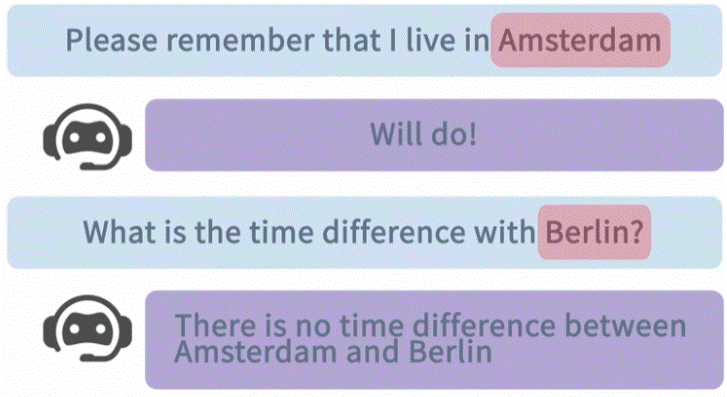

__note__ these steps are __add__ to the exciting files (from example 1).

__step 1:__ adding intents to the __nlu.yml__ file;

```nlu.yml
- intent: where_i_live
  examples: |
    - please remember that i live in [Amsterdam](place)?
    - my house is in [London](place)
    - reminder. i live in [Lisbon](place)
    - my residence is in [Berlin}(place)
    - remeber that i live in [london](place)
- intent: inquire_time_difference
  examples: |
    - time difference between [Amsterdam(place)?
    - what is my time difference with [London](place)?
    - how bigis the time delta with [Berlin](place)?
    - is there a time difference with [Lisbon](place)?
    - what is the time difference with[amsterdam](place)
```

__step 1:__ adding a role to activate the intents in the __rules.yml__ file;

```rules.yml
- rule: Where I live intent
  steps:
  - intent: where_i_live
  - action: action_remember_where

- rule: Time Difference Intent
  steps:
  - intent: inquire_time_difference
  - action: action_time_difference
```

__step 2:__ inside the __domain.yml__ we need to configure the domain the for the custom action to "work" (add the intent, entities, custom action  we created)

__step 3:__ in the custom action file (actions.py) we need to add two more custom actions (action_remember_where and action_time_difference);

Add to the import section:
```actions.py
    from rasa_sdk.events import SlotSet
```

Add this class 
```actions.py
class ActionRememberWhere(Action):
    def name(self) -> Text:
        return "action_remember_where"

    def run(self, dispatcher: CollectingDispatcher, tracker: Tracker, domain: Dict[Text, Any]) -> List[Dict[Text, Any]]:
        current_place = next(tracker.get_latest_entity_values("place"), None) # gets the "place" if its empty it will fill with "None"
        # utc.arrow.utcnow()
        if current_place:
            current_place = current_place.lower()
        print("DEBUG current_place =", repr(current_place))
        # if current_place is empty it return a utc time - a fallback
        if not current_place:
            msg = f"I didn't get where you live. Are you sure it's spelled correctly?"
            dispatcher.utter_message(text=msg)
            return []

        # if current_place not found in the database - a fallback
        tz_string = city_db.get(current_place, None)
        if not tz_string:
            msg = f"I didn't recognize {current_place}. Is it spelled correctly?"
            dispatcher.utter_message(text=msg)
            return []

        msg = f"Sure thing! I'll remember that you live in {current_place}."
        dispatcher.utter_message(text=msg)

        return [SlotSet("location", current_place)]
```

Aslo add this code (another action - action_time_difference);

```actions.py
class ActionTimeDifference(Action):

    def name(self) -> Text:
        return "action_time_difference"

       
    def run(self, dispatcher: CollectingDispatcher, tracker: Tracker, domain: Dict[Text, Any]) -> List[Dict[Text, Any]]:
        timezone_to = next(tracker.get_latest_entity_values("place"), None)
        timezone_in = tracker.get_slot("location")
        if timezone_to:
            timezone_to = timezone_to.lower()
        print("DEBUG current_place =", repr(timezone_to))
        if not timezone_in:
            msg = "To calculuate the time difference I need to know where you live."
            dispatcher.utter_message(text=msg)
            return []

        if not timezone_to:
            msg = "i didn't find the timezone you'd like to compare against. Are you sure it's spelled correctly?"
            dispatcher.utter_message(text=msg)
            return []

        tz_string = city_db.get(timezone_to, None)
        if not tz_string:
            msg = f"I didn't recognize {timezone_to}. Is it spelled correctly?"
            dispatcher.utter_message(text=msg)
            return []

        t1 = arrow.utcnow().to(city_db[timezone_to.lower()])
        t2 = arrow.utcnow().to(city_db[timezone_in.lower()])
        diff_hours = abs((t1 - t2).total_seconds() // 3600)
        diff_hours = min(diff_hours, 24 - diff_hours)

        msg = f"There is a {min(diff_hours, 24-diff_hours)}H time difference."
        dispatcher.utter_message(text=msg)

        return []
```
## To run it 
There a need to run both the rasa NLU and the custom action api on two separate terminals (unless you configure it to work in the same rasa service - as shown above).

starting the custom action api (done on 1 terminal)
```terminal
    rasa run action
```
starting the custom action api (done on 2 terminal)
```terminal
    rasa interactive
```
__*Note:__
rasa interactive - a mode that lets you chat with your assistant in real time, see every step it takes (intents, entities, actions, and predictions), and correct or confirm them to improve your training data instantly.

this is the __domain.yaml__ file
```yaml
version: "3.1"

intents:
  - greet
  - goodbye
  - affirm
  - deny
  - mood_great
  - mood_unhappy
  - bot_challenge
  - inquire_time
  - where_i_live
  - inquire_time_difference

responses:
  utter_greet:
  - text: "Hey! How are you?"

  utter_cheer_up:
  - text: "Here is something to cheer you up:"
    image: "https://i.imgur.com/nGF1K8f.jpg"

  utter_did_that_help:
  - text: "Did that help you?"
    buttons:
    - title: "Yes"
      payload: "/affirm"
    - title: "No"
      payload: "/deny"

  utter_happy:
  - text: "Great, carry on!"

  utter_goodbye:
  - text: "Bye"

  utter_iamabot:
  - text: "I am a bot, powered by Rasa."

entities:
  - place

actions:
  - action_tell_time
  - action_time_difference
  - action_remember_where

slots:
  place:
    type: text
    influence_conversation: False
    mappings:
    - type: from_entity
      entity: place
      intent: inquire_time
    - type: from_entity
      entity: place
      intent: inquire_time_difference      
  location:
    type: text  
    influence_conversation: False
    mappings:
    - type: from_entity
      entity: place
      intent: where_i_live
    
session_config:
  session_expiration_time: 60
  carry_over_slots_to_new_session: true
```
